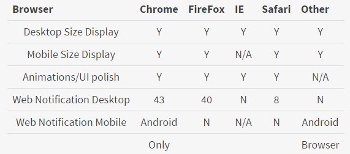

#CSE 134B Homework 4

##Team Avenger
* Xin Wen
* Hong Sun
* Jian Xue
* Chenyin Liu

##Important: Browsing through our AWS [host](http://52.8.46.213:8080/HW4/src/), otherwise notification will NOT work.
###Note: We used Parse user login, so you must sign up and log in first, 
directly go into other pages may resulting unwanted error. For best result viewing the habit, 
use username test@gmail.com password 123 login. Otherwise data will be zero.

##CRUD Functions For Habits

We are using parse as our database provider. NOT local storage, so data is real and transferred through
Internet. Make sure that you are connected. Alert will be shown if some operations failed unexpectedly.
All the CRUD related to habits we used Parse REST API to get the data,
AJAX to make the connection, and jQuery to re-render the HTML.

###For Habit CRUD:
* Create function is located in add.js.
* Read function is located in list.js. 
* Update function is located in edit.js.
* Delete function is located in list.js.
* Green check button will increase daily check number and also the text of that will be shown.

##Validations
We have user input validation on each of the operation that puts data
to Parse. For example, we have regular expression check for email input
on signup/signin input box. Password will be checking for null or empty
string.
XSS validation could be done through regex check, for example, title cannot accept anything other
than English characters.

##UI Focused JavaScript
* We heavily used [Material Design Lite](http://www.getmdl.io/index.html)
to polish the look of the original element (button, list, shadows, menus, etc.).
* [Animate.css](https://daneden.github.io/animate.css/)
for transition animation. We have tons of slide/fade in/out.
* We tried NOT to change the original html code too much and change the look
through jQuery in the Javascript file. Except list page that's dyamic 
* Progress Bar changed to animated using CSS [Credit](https://css-tricks.com/css3-progress-bars/)
* List rendered dynamically based on data through a template html with many javascript/jQuery manipulations.

##Notification Logic
* Notification service done using Web Notification API that given in the assignment description which
must supported by web browser. Thus, NO notification will be showing after our web page is closed.
* Notification service starts upon user land into habit list and/or upon list page initialized.


#####When will I get a notification?
* First we will choose a most ignored habit from database, notify user for that habit. 
e.g You will receive a notification about your least recent done habit when you 
landing on habit list page.
* Then if no habits in the list, we will notify user to add a habit.
* Thirdly, if user ignores an habit for a while, we will notify user.
* Others, successful / error CRUD operations (Not sure if we have time do that).

#####Notification behavior
* Click on notification: show up a few options on that particular habit on top right or that row.
* Close Notificaion: triggers default call back which we would like is behavior like snooze for 15 minutes.
* Did nothing: notification close after a while by itself, and it will trigger close notification.


##Changes Made to Adapt Notifications
* Added Settings button under main habit list.
* Add Menu on list object for showing options after clicked a notification.
* Notification menu options are for displaying only, correct data has been gotten and showed through alert, 
  which these data can be directly updated to database for further use. For example, an object id 
  will be given when click snooze 15 minutes.

##Exceptions
* All data input through form has been checked, if an data runs into error state, a error message
will be shown immediately under the form.
* User Auth Handled by Parse, though you could access page through html directly, but there won't
be an error, only no data can be shown. So for testing, you should login once per device.
* Defaults has been set such as radio on daily frequency and number input only on other preferred
frequency. We also have other defaults set while we transfer data through database, for example, 
newly added habit will be shown "0 days in a row".

##Browser Conformance
Support behavior: Y or version above that supported
Not Supported: N  
|       Browser            | Chrome | FireFox |   IE   | Safari | Other |
|:------------------------:|:------:|:-------:|:------:|:------:|:-----:|
| Desktop Size Display     |   Y    |   Y     |   Y    |   Y    |  Y    |
| Mobile Size Display      |   Y    |   Y     |   N/A  |   Y    |  Y    |
| Animations/UI polish     |   Y    |   Y     |   Y    |   Y    |  N/A  |
| Web Notification Desktop |   43   |   40    |   N    |   8    |  N    |
| Web Notification Mobile  |Android |   N     |   N/A  |   N    |Android|
|                          |Only    |         |        |        |Browser|



##Work Credit
Xin Wen: All areas
Hong Sun: All areas
Jian Xue: Javascript Edit/Add
Chenyin Liu: Support..


#Homework 5

##Error Monitoring
* Our team uses Rollbar and install Rollar library which is saved in rollbar.js under js folder. Our team members can recieve notification from it through our email address. 

##Usage Analytics
* We use Mixpanel and install Mixpanel library which is saved in mixpanel.js under js folder. Our team members can recieve notification from it through our email address. 

##Android and iOS app
We are using Phonegap framework to deliver apps. Both platforms app has been successfully created that under
the folder ```cse134b/cse134b-app/HabitApp/platforms```. you can find ```ios``` and ```android``` folder that 
contains the corresponding project. The iOS version should be okay with most current device, and for
Android the minimium requirement is API22.
---
####How to run?
* For ios, you have to build the project and run it in simulator or real device
if you have apple id to sign the code. Additionaly, you have to trust the signer in Settings/Gerneral/profile to actually run on a real device.
* For android, simply install the built .apk file under the ```/android/build/outputs/apk/android-debug.apk```. 
Or you can build your own through Android Studio or command line tools.
* Alternatively, you can run phonegap dev to test easier. Just host Habitapp folder in your phonegap dev app.
You can also rebuild both android and ios version if you have phonegap CLI tools installed. Use command
```phonegap build android ios``` 
under Habitapp folder.